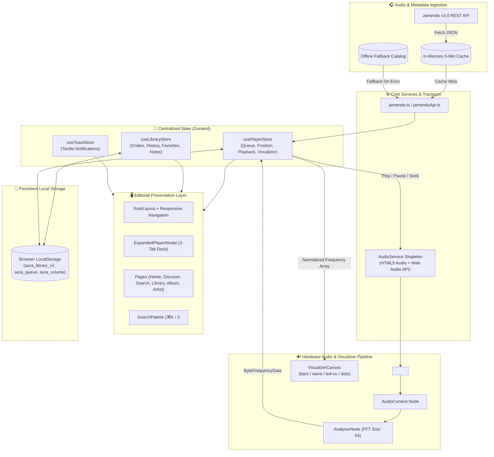

# <div align="center">🎧 AURA</div>

<div align="center">

### Sonic Sanctuary, Tactile Master Deck & Independent Audio Discovery

*A contemplative music discovery platform and tactile audio journal curating ambient, neo-classical, electronic, and lo-fi soundscapes under Creative Commons.*

[](https://react.dev/)
[](https://www.typescriptlang.org/)
[](https://tailwindcss.com/)
[](https://vitejs.dev/)
[](https://github.com/pmndrs/zustand)
[](./LICENSE)
[](https://github.com/Void8478/Aura/actions)

**[🌐 GitHub Repository](https://github.com/Void8478/Aura) · [📖 Documentation](#-table-of-contents) · [🐛 Issues](https://github.com/Void8478/Aura/issues) · [✨ Feature Requests](https://github.com/Void8478/Aura/issues)**

</div>

---

<div align="center">
  
</div>

---

## 📖 Table of Contents

- [🌿 Overview](#-overview)
  - [The Problem](#the-problem)
  - [The AURA Solution](#the-aura-solution)
  - [Target Audience](#target-audience)
- [✨ Core Features](#-core-features)
- [🎛️ Tactile Master Deck & Visualizer](#️-tactile-master-deck--visualizer)
- [🏗️ System Architecture](#️-system-architecture)
  - [Audio & Data Pipeline](#audio--data-pipeline)
  - [Route Splitting & Performance](#route-splitting--performance)
- [🛠️ Technology Stack](#️-technology-stack)
- [📁 Project Structure](#-project-structure)
- [🚀 Quick Start](#-quick-start)
  - [Prerequisites](#prerequisites)
  - [Installation Steps](#installation-steps)
- [⚙️ Environment Configuration](#️-environment-configuration)
- [⌨️ Keyboard Navigation](#️-keyboard-navigation)
- [🔌 Jamendo API Integration](#-jamendo-api-integration)
  - [Query Endpoints](#query-endpoints)
  - [Resilient Caching & Offline Fallback](#resilient-caching--offline-fallback)
- [🎨 Design System & Editorial Aesthetics](#-design-system--editorial-aesthetics)
  - [Color Palette Tokens](#color-palette-tokens)
  - [Typography Hierarchy](#typography-hierarchy)
- [🚢 Build & Deployment](#-build--deployment)
  - [Production Compilation](#production-compilation)
  - [Static Analysis & Linting](#static-analysis--linting)
  - [Vercel Deployment](#vercel-deployment)
  - [Docker Containerization](#docker-containerization)
- [🔐 Security & Privacy Architecture](#-security--privacy-architecture)
- [🐛 Troubleshooting](#-troubleshooting)
- [❓ Frequently Asked Questions](#-frequently-asked-questions)
- [🤝 Contributing](#-contributing)
- [📄 License & Credits](#-license--credits)

---

## 🌿 Overview

**AURA** is an editorial web-based audio player and contemplative music journal designed as an antidote to hyper-stimulating, algorithmic streaming platforms. Engineered for deep focus workers, ambient music aficionados, and acoustic purists, AURA marries physical music journalism aesthetics with the tactile feedback of reel-to-reel tape decks and analog synthesizers.

Streaming directly from the open **Jamendo Music Catalog** under Creative Commons licensing, AURA serves legal, independent music accompanied by rich curator notes, acoustic telemetry (BPM, musical keys, waveforms), and a sovereign listening journal that stays on your device.

### The Problem
Commercial streaming applications are engineered around algorithmic retention loops, endless autoplay queues, sponsored track insertions, and data harvesting. Audio playback is divorced from context, and technical acoustic metadata (key signatures, tempo, audio fidelity) is stripped away behind opaque user interfaces.

### The AURA Solution

| Traditional Streaming Services | The AURA Experience |
|---|---|
| 📉 Algorithmic feeds engineered for hyper-retention | 📜 Thoughtfully curated quarterly editions & slow discovery |
| 🪟 Cluttered, noisy user interfaces | 🧘 Warm dark backdrop (`#0e0e11`), editorial serif typography, tactile equipment panels |
| 🌫️ Compressed audio with hidden technical data | 📊 Real-time 64-bin FFT spectral visualizer, BPM, and musical key telemetry |
| ☁️ Proprietary lock-in & continuous behavioral tracking | 🔒 Offline-first, client-side persistence via `localStorage` with zero data harvesting |
| 🔇 Flat cards and generic corporate carousels | 🎚️ Physical tactile controls, analog VU-meter emulations, and command-palette navigation |

### Target Audience
- **Knowledge Workers & Programmers**: Requiring unobtrusive, loop-friendly focus soundscapes without lyrical clutter.
- **Ambient & Neo-Classical Enthusiasts**: Listeners who appreciate acoustic space, modular synthesis, and slow discovery.
- **Audiophiles & Hardware Lovers**: Users who miss tactile physical equipment, reel-to-reel decks, and real-time frequency analysis.
- **Independent Music Supporters**: Those who want to discover Creative Commons creators without corporate paywalls.

---

## ✨ Core Features

### 1. 🎛️ Real-Time FFT Spectral Visualizer & Audio Engine
- **Singleton Audio Architecture**: Centralized `AudioService` prevents duplicate nodes, memory leaks, and overlapping playback across route changes.
- **Dynamic 64-Bin Fast Fourier Transform (FFT)**: Hardware-accelerated Canvas spectrum analyzer calculating frequency bins straight from the live audio stream buffer.
- **4 Visualizer Render Modes**:
  - `bars`: Dynamic 16-band gradient spectrum bars.
  - `wave`: Smooth analog oscilloscope waveform trace.
  - `led-vu`: 10-segment segmented vintage LED VU-meter with amber/olive peak indicators.
  - `minimal-dots`: Zen pulsing ambient focus indicators.

### 2. 📖 Tactile Master Deck & Expanded Overlay
- **Framer Motion Spatial Transitions**: Seamless morphing between the docked bottom mini-player and the immersive full-screen Master Deck modal.
- **Three-Panel Modular Inspection**:
  - **Deck Panel**: Vinyl spinning disk animation, scrub bar, volume slider, shuffle, repeat, and visualizer mode selector.
  - **Liner Notes**: Editorial curator critique, story quote, and an interactive **Personal Listening Journal** allowing listeners to record thoughts, timestamps, and locations.
  - **Acoustic Telemetry**: Complete acoustic data readout including BPM, key signature, frequency tags, release date, audio format (MP3 320kbps), and CC licensing parameters.

### 3. 📦 Crate Management & Sovereign Library
- **Listening Crates (Playlists)**: Full local CRUD capability—create thematic crates, add custom color tags, edit descriptions, append tracks, and re-order queues.
- **Rolling Playback Timeline**: Automated 50-track listening archive with duplicate de-duplication (bumping replayed tracks to the top).
- **Multi-Tier Favorites**: Bookmark individual tracks, full albums, or composer profiles with instant reactive UI updates.

### 4. 🌐 Jamendo Creative Commons Discovery & Offline Fallback
- **Live Open API Integration**: Real-time querying against the Jamendo v3.0 REST API for tracks, featured picks, albums, and artist discographies.
- **In-Memory Cache (TTL)**: 5-minute request caching layer that prevents redundant network roundtrips and avoids API rate exhaustion.
- **Resilient Fallback Catalog**: Pre-bundled high-fidelity offline fallback database guaranteeing seamless playback even when disconnected or when the API key is unavailable.

### 5. 🧭 Curated Mood Spaces & Sonic Taxonomy
- **8 Acoustic Mood Spaces**: *Late Night*, *Deep Focus*, *Hypnotic*, *Melancholic*, *Ethereal*, *Warm & Analog*, *Meditative*, and *Urban Drift*.
- **10 Editorial Genres**: *Ambient*, *Lo-Fi*, *Neo-Classical*, *Electronic*, *Jazz Fusion*, *Downtempo*, *Minimalism*, *Post-Rock*, *Modular*, and *Indie*.

### 6. ⚡ Power-User Command Palette & Shortcuts
- **Global Command Bar**: Instant overlay search triggered via `⌘K` or `/` across tracks, artists, albums, and moods.
- **Complete Tactile Keyboard Controls**: Full keyboard bindings for play/pause, skips, seeks, mute, favorites, visualizer toggles, and queue drawers.

---

## 🎛️ Tactile Master Deck & Visualizer

AURA's centerpiece is the **Expanded Master Deck Modal**, rendering tactile hardware equipment right inside the browser:

```text
┌────────────────────────────────────────────────────────────────────────┐
│  [×] CLOSE             AURA MASTER DECK // TACTILE 01                  │
├────────────────────────────────────────────────────────────────────────┤
│                                                                        │
│   ┌───────────────────────┐   [ Deck ]  [ Liner Notes ]  [ Telemetry ] │
│   │                       │                                            │
│   │    [ ARTWORK VINYL ]  │   Title:       Reel-to-Reel Tape Study     │
│   │     (Spinning Disc)   │   Artist:      Elena Rostova               │
│   │                       │   BPM / Key:   74 BPM • D Minor            │
│   └───────────────────────┘   Mood:        Deep Focus                  │
│                                                                        │
│   ◄◄   [ ▶ PLAY / ⏸ PAUSE ]   ►►   🔀 SHUFFLE   🔁 REPEAT (OFF/ALL/1) │
│                                                                        │
│   02:14 ━━━━━━●────────────────────────────────────────────── 05:42    │
│                                                                        │
│   [ ▂▃▅▆▇▆▅▃▂  LIVE 64-BIN FFT FREQUENCY SPECTRUM ANALYZER  ]          │
│   Modes: [ Bars ]  [ Oscilloscope ]  [ LED-VU ]  [ Minimal Dots ]      │
│                                                                        │
│   🔊 ━━━━━━━━●────────── 85%             ❤️ [ Add to Personal Crate ]  │
└────────────────────────────────────────────────────────────────────────┘
```

---

## 🏗️ System Architecture

AURA is engineered as a deterministic, offline-first Single Page Application (SPA). State flows unidirectionally from services into reactive Zustand slices, driving hardware-accelerated UI updates:



### Route Splitting & Performance
Every dynamic route (`/discover`, `/search`, `/library`, `/favorites`, `/recent`, `/album/:id`, `/artist/:id`, `/playlist/:id`, `/about`) is lazily loaded via `React.lazy()` and encapsulated within `<React.Suspense>`. This strategy keeps the initial entry chunk to under **140 kB gzip**, guaranteeing near-instantaneous First Contentful Paint (FCP).

---

## 🛠️ Technology Stack

| Domain | Technology | Version | Rationale |
|---|---|---|---|
| **Core Framework** | [React](https://react.dev/) | `19.2.8` | Concurrent rendering engine, smooth transitions, and stable hook lifecycle |
| **Language** | [TypeScript](https://www.typescriptlang.org/) | `~6.0.2` | Complete static type safety across audio domain entities, API contracts, and stores |
| **Bundler & Dev Server** | [Vite](https://vitejs.dev/) | `^8.2.2` | Sub-second Hot Module Replacement (HMR) and optimized Rollup builds |
| **Styling** | [Tailwind CSS v4](https://tailwindcss.com/) | `^4.3.3` | `@theme` CSS variable tokens, container queries, and zero-runtime overhead |
| **Animations** | [Framer Motion](https://www.framer.com/motion/) | `^13.1.1` | Tactile spring physics, modal morphing, and gesture interactions |
| **State Management** | [Zustand](https://github.com/pmndrs/zustand) | `^5.0.15` | Minimalist boilerplate-free flux state with deep `localStorage` sync |
| **Routing** | [React Router](https://reactrouter.com/) | `^7.18.3` | URL-driven route orchestration and dynamic parameter parsing |
| **Audio Engine** | [Web Audio API](https://developer.mozilla.org/en-US/docs/Web/API/Web_Audio_API) | Native | Real-time byte frequency analysis via browser `AudioContext` & `AnalyserNode` |
| **Iconography** | [Lucide React](https://lucide.dev/) | `^1.37.0` | Crisp, tree-shakable SVG icons |
| **Linter** | [Oxlint](https://oxc.rs/) | `^1.79.0` | Ultra-high performance Rust-based JavaScript and TypeScript linter |
| **Audio Source** | [Jamendo API](https://developer.jamendo.com/v3.0) | `v3.0` | Legal, independent audio catalog under Creative Commons licenses |

---

## 📁 Project Structure

```text
AURA/
├── .env.example                 # Environment variables template
├── .gitignore                   # Git exclusion rules
├── .oxlintrc.json               # Oxlint static analysis rules
├── CODE_OF_CONDUCT.md           # Community guidelines and standards
├── CONTRIBUTING.md              # Contributor workflow and PR guidelines
├── Dockerfile                   # Multi-stage production container build
├── .dockerignore                # Container build exclusions
├── index.html                   # HTML entry point, Google Fonts, and meta headers
├── LICENSE                      # MIT Open-Source License
├── package.json                 # Project dependencies, scripts, and engine metadata
├── README.md                    # Project documentation
├── SECURITY.md                  # Vulnerability disclosure and privacy policy
├── tsconfig.json                # TypeScript root configuration
├── tsconfig.app.json            # Client application compilation rules
├── tsconfig.node.json           # Build tooling TypeScript configuration
├── vercel.json                  # SPA routing rewrite rule for Vercel
├── vite.config.ts               # Vite bundler plugins and Tailwind v4 integration
│
├── .github/
│   ├── ISSUE_TEMPLATE/
│   │   ├── bug_report.md        # Structured bug report template
│   │   └── feature_request.md   # Tactile enhancement request template
│   ├── PULL_REQUEST_TEMPLATE.md # PR verification checklist
│   └── workflows/
│       └── ci.yml               # GitHub Actions Lint and Build workflow
│
├── public/
│   ├── favicon.svg              # Vector brand favicon
│   └── icons.svg                # Shared SVG icon sprites
│
└── src/
    ├── App.css                  # Component-level animations and keyframe rules
    ├── App.tsx                  # Lazy route declarations and RootLayout router
    ├── index.css                # Tailwind v4 theme tokens, fonts, and dark palette
    ├── main.tsx                 # React 19 root bootstrap
    │
    ├── assets/                  # Static brand assets and imagery
    │   └── hero.png             # Editorial interface banner
    │
    ├── components/
    │   ├── brand/
    │   │   └── Logo.tsx         # Vector SVG "A" ribbon logo and geometric wordmark
    │   ├── common/
    │   │   ├── CuratorNote.tsx  # Editorial pull-quote and curator stamp
    │   │   ├── EditorialCard.tsx# Featured story presentation card
    │   │   ├── EmptyState.tsx   # Visual empty states for lists and crates
    │   │   ├── ErrorState.tsx   # Error recovery banner with retry trigger
    │   │   ├── KeyboardShortcutsModal.tsx # Keyboard cheatsheet overlay
    │   │   └── TrackRow.tsx     # Tactile track listing with playback trigger
    │   ├── layout/
    │   │   ├── Header.tsx       # Top navigation, search trigger, and breadcrumbs
    │   │   ├── Footer.tsx       # Editorial publication footer
    │   │   └── Layout.tsx       # Content scaffolding wrapper
    │   ├── music/
    │   │   ├── AlbumCard.tsx    # Vinyl gatefold-style album card
    │   │   ├── ArtistCard.tsx   # Rounded composer spotlight card
    │   │   ├── PlaylistCard.tsx # Crate overview card with color tags
    │   │   └── SectionHeader.tsx# Editorial eyebrow + serif heading component
    │   ├── player/
    │   │   ├── AudioPlayer.tsx  # Docked bottom mini-player with scrubber
    │   │   ├── ExpandedPlayerModal.tsx # Fullscreen 3-tab tactile master deck
    │   │   ├── QueueDrawer.tsx  # Slide-out listening queue manager
    │   │   ├── TrackProgress.tsx# Interactive audio time scrub bar
    │   │   ├── VisualizerCanvas.tsx # 64-bin FFT canvas spectrum visualizer
    │   │   └── VolumeSlider.tsx # Tactile volume attenuator slider
    │   ├── search/
    │   │   ├── SearchInput.tsx  # Input component with debounce support
    │   │   └── SearchPalette.tsx# ⌘K Command palette with live filtering
    │   └── ui/
    │       ├── ArtworkImage.tsx # Image loader with graceful fallback skeleton
    │       ├── Badge.tsx        # Tag and genre pill badge
    │       ├── Button.tsx       # Core accessible button primitive
    │       ├── Input.tsx        # Accessible form input
    │       ├── Modal.tsx        # Framer Motion accessible dialog
    │       ├── Skeleton.tsx     # Shimmer skeleton loading placeholders
    │       ├── TactileButton.tsx# Hardware-button click physics component
    │       └── Toast.tsx        # Transient library status notifications
    │
    ├── data/
    │   ├── mockData.ts          # Curated albums, playlists, and stations
    │   └── mockTracks.ts        # Seed library with pre-rendered waveforms
    │
    ├── hooks/
    │   └── useKeyboardShortcuts.ts # Global window key listener and dispatcher
    │
    ├── layouts/
    │   └── RootLayout.tsx       # Application shell with sticky audio dock
    │
    ├── pages/
    │   ├── AboutPage.tsx        # Manifesto, editorial philosophy, and team
    │   ├── AlbumDetailPage.tsx  # Tracklist, release notes, and album essays
    │   ├── ArtistDetailPage.tsx # Composer profile, biography, and top works
    │   ├── DesignTestPage.tsx   # Component isolation sandbox
    │   ├── DiscoverPage.tsx     # Deep filtering by mood, genre, and curation
    │   ├── FavoritesPage.tsx    # Liked tracks, bookmarked albums, and artists
    │   ├── HomePage.tsx         # Curated sound editions and hero release
    │   ├── LibraryPage.tsx      # Personal crates and track commentary journal
    │   ├── PlaylistDetailPage.tsx # Individual crate track management
    │   ├── RecentPage.tsx       # Chronological 50-track listening log
    │   └── SearchPage.tsx       # Dedicated catalog search interface
    │
    ├── services/
    │   ├── audioService.ts      # Singleton managing AudioContext, Analyser & HTML5 Audio
    │   ├── jamendo.ts           # High-level cached Jamendo catalog service
    │   ├── jamendoApi.ts        # Direct Jamendo v3.0 REST API caller
    │   └── mockCatalog.ts       # Resilient offline catalog database
    │
    ├── store/
    │   ├── useLibraryStore.ts   # Crates CRUD, favorites, notes & history store
    │   ├── usePlayerStore.ts    # Audio state, playback queue & telemetry store
    │   └── useToastStore.ts     # Ephemeral notifications store
    │
    ├── types/
    │   └── music.ts             # Domain interfaces (Track, Album, Artist, Crate, etc.)
    │
    └── utils/
        └── formatters.ts        # Seconds to MM:SS, BPM, and date utilities
```

---

## 🚀 Quick Start

### Prerequisites
- **Node.js**: `v18.0.0` or later (tested on Node `v20.x` & `v22.x`)
- **Package Manager**: `npm` (v9+), `pnpm`, or `yarn`
- **Modern Web Browser**: Chrome, Edge, Firefox, or Safari with Web Audio API support

### Installation Steps

1. **Clone the repository**:
   ```bash
   git clone https://github.com/Void8478/Aura.git
   cd Aura
   ```

2. **Install project dependencies**:
   ```bash
   npm install
   ```

3. **Configure environment variables**:
   ```bash
   cp .env.example .env
   ```
   *(A public Jamendo Client ID is already pre-configured in `.env.example`, allowing instant streaming without registration).*

4. **Launch the development server**:
   ```bash
   npm run dev
   ```

5. **Open the local application**:
   Open **`http://localhost:5173/`** in your browser.

---

## ⚙️ Environment Configuration

All environment variables in AURA are prefixed with `VITE_` to allow client-side bundling:

| Variable | Required | Default Value | Description |
|---|:---:|---|---|
| `VITE_JAMENDO_CLIENT_ID` | ❌ *(Optional)* | `e7beea4a` | Jamendo API Client ID for querying music streams. Uses pre-configured public key if omitted. |
| `VITE_APP_TITLE` | ❌ *(Optional)* | `AURA` | Application title rendered in header banners and browser tab titles. |
| `VITE_APP_ENV` | ❌ *(Optional)* | `development` | Deployment environment identifier (`development`, `staging`, `production`). |

> [!TIP]
> If you wish to register personal Jamendo API credentials, create a free account at the [Jamendo Developer Portal](https://developer.jamendo.com/) and replace the `VITE_JAMENDO_CLIENT_ID` value in your `.env` file.

---

## ⌨️ Keyboard Navigation

AURA features extensive hardware-style keyboard shortcuts, enabling full navigation and playback control without touching a mouse:

| Key Binding | Action | Description |
|---|---|---|
| <kbd>Space</kbd> | **Play / Pause** | Toggles audio playback for the active track |
| <kbd>N</kbd> | **Next Track** | Advances to the next item in the listening queue |
| <kbd>P</kbd> | **Previous Track** | Skips to the previous track (or restarts if > 3s played) |
| <kbd>→</kbd> | **Seek Forward** | Jumps ahead 5 seconds in playback position |
| <kbd>←</kbd> | **Seek Backward** | Rewinds 5 seconds in playback position |
| <kbd>M</kbd> | **Mute / Unmute** | Toggles audio volume with state memory |
| <kbd>L</kbd> | **Favorite Track** | Adds or removes the active track from your favorites |
| <kbd>V</kbd> | **Master Deck** | Toggles the expanded full-screen tactile visualizer deck |
| <kbd>Q</kbd> | **Queue Drawer** | Opens or closes the listening queue slide-out drawer |
| <kbd>⌘K</kbd> or <kbd>/</kbd> | **Search Palette** | Launches the command palette for instant track lookup |
| <kbd>?</kbd> | **Shortcuts Modal** | Displays the on-screen tactile keyboard reference modal |
| <kbd>Esc</kbd> | **Dismiss** | Closes any open modal, palette, or drawer |

---

## 🔌 Jamendo API Integration

AURA interfaces with the official **Jamendo v3.0 REST API** via two specialized service modules (`jamendoApi.ts` and `jamendo.ts`).

### Query Endpoints

| Method | Jamendo Endpoint | Description | Cache Policy |
|---|---|---|---|
| `searchTracks(query)` | `/tracks/?namesearch={query}` | Searches catalog by song, artist, album, or genre | 5-Minute In-Memory |
| `getFeaturedTracks()` | `/tracks/?featured=true` | Retrieves editorially spotlighted independent tracks | 5-Minute In-Memory |
| `getPopularTracks()` | `/tracks/?order=popularity_month` | Fetches monthly trending ambient & lo-fi tracks | 5-Minute In-Memory |
| `getTracksByGenre(genre)` | `/tracks/?tags={genre}` | Retrieves songs filtered by specific acoustic tags | 5-Minute In-Memory |
| `getArtist(artistId)` | `/artists/?id={artistId}` | Returns artist biography, member details, and artwork | 5-Minute In-Memory |
| `getAlbum(albumId)` | `/albums/?id={albumId}` | Retrieves album tracklist, release year, and cover art | 5-Minute In-Memory |

### Resilient Caching & Offline Fallback
- **TTL Cache**: Responses are cached in-memory with a 5-minute Time-To-Live (TTL) using request URL keys, preventing redundant network overhead.
- **Graceful Fallback**: If network calls fail, exceed a 4000ms timeout threshold, or encounter rate limits, AURA intercepts the failure and transparently provides matching items from `src/services/mockCatalog.ts`.

---

## 🎨 Design System & Editorial Aesthetics

The visual language of AURA reflects a physical high-fidelity acoustic journal:

### Color Palette Tokens
Configured via Tailwind CSS v4 `@theme`:
- **Canvas Base**: `#0e0e11` (Deep warm obsidian)
- **Substrate Cards**: `#141418` / `#1c1c22` (Brushed anodized metal)
- **Primary Accent**: `#e07a5f` (Terracotta warmth)
- **Secondary Tone**: `#d4a373` (Amber tape reel)
- **Tertiary Tone**: `#819875` (Olive green acoustic felt)
- **Typography Scale**: `#f4f2f8` (Headings) → `#9491a1` (Muted telemetry metadata)

### Typography Hierarchy
- **Editorial Headlines**: [*Fraunces*](https://fonts.google.com/specimen/Fraunces)—Variable optical size editorial serif with delicate italic flourishes.
- **Interface & Body**: [*Plus Jakarta Sans*](https://fonts.google.com/specimen/Plus+Jakarta+Sans)—Geometric, highly legible grotesque sans-serif.
- **Technical Telemetry**: [*JetBrains Mono*](https://fonts.google.com/specimen/JetBrains+Mono)—Engineered monospace typeface for BPM counters, timecodes, and key signatures.

---

## 🚢 Build & Deployment

### Production Compilation
To compile the TypeScript code and generate an optimized production bundle:
```bash
npm run build
```
This triggers TypeScript verification (`tsc -b`) followed by Vite's production build. Output is compiled into `/dist`.

To preview the production bundle locally:
```bash
npm run preview
```

### Static Analysis & Linting
AURA uses **Oxlint** for ultra-fast static analysis:
```bash
npm run lint
```

### Vercel Deployment
AURA includes a pre-configured `vercel.json` for client-side SPA routing:

```json
{
  "rewrites": [
    {
      "source": "/(.*)",
      "destination": "/index.html"
    }
  ]
}
```

1. Push your repository to GitHub.
2. Import the project into [Vercel](https://vercel.com/new).
3. Confirm Vite defaults:
   - **Framework Preset**: `Vite`
   - **Build Command**: `npm run build`
   - **Output Directory**: `dist`
4. Click **Deploy**.

### Docker Containerization
To deploy AURA in a container using Nginx:

```dockerfile
# Build Stage
FROM node:20-alpine AS builder
WORKDIR /app
COPY package*.json ./
RUN npm ci
COPY . .
RUN npm run build

# Production Server Stage
FROM nginx:alpine
COPY --from=builder /app/dist /usr/share/nginx/html
RUN echo 'server { \
    listen 80; \
    location / { \
        root /usr/share/nginx/html; \
        try_files $uri $uri/ /index.html; \
    } \
}' > /etc/nginx/conf.d/default.conf
EXPOSE 80
CMD ["nginx", "-g", "daemon off;"]
```

Build and run:
```bash
docker build -t aura-music .
docker run -d -p 8080:80 --name aura aura-music
```
Visit `http://localhost:8080/` in your browser.

---

## 🔐 Security & Privacy Architecture

- **Zero Analytics & Tracking**: AURA contains zero telemetry beacons, third-party analytics trackers, or user fingerprinting scripts.
- **Local Data Sovereignty**: All crates, favorites, listening history, and personal journal entries remain isolated inside browser `localStorage`.
- **CORS Audio Handling**: Remote audio streams are loaded with `crossOrigin = "anonymous"`. If a remote host enforces strict CORS policies preventing Web Audio buffer inspection, AURA degrades gracefully without throwing fatal audio playback exceptions.
- **Environment Isolation**: No sensitive private keys or database passwords exist in the client repository. Only public client IDs prefixed with `VITE_` are exposed.

---

## 🐛 Troubleshooting

### ❌ Problem: Audio playback does not start on page load
> **Cause**: Modern browsers enforce autoplay policies that restrict unmuted audio from playing before a user performs an interaction with the document.
>
> **✅ Solution**: Click any track row, tap the play button in the dock, or press <kbd>Space</kbd> to initialize the Web Audio `AudioContext`.

### ❌ Problem: Visualizer displays flat lines during audio playback
> **Cause**: Remote stream CORS headers can occasionally restrict the Web Audio `MediaElementSourceNode` from extracting raw byte frequency data.
>
> **✅ Solution**: AURA automatically sets `crossOrigin = "anonymous"`. If a third-party server restricts frequency reads, AURA provides an animated fallback motion curve to maintain UI continuity.

### ❌ Problem: 404 Not Found error when refreshing pages on Vercel
> **Cause**: Deep client-side routes like `/album/:id` or `/discover` require the web server to rewrite all requests back to `/index.html`.
>
> **✅ Solution**: Ensure `vercel.json` exists in the project root with the rewrite configuration described in [Vercel Deployment](#vercel-deployment).

---

## ❓ Frequently Asked Questions

### Is an account required to use AURA?
No. AURA is completely free, un-gated, and anonymous. No signups, email entries, or passwords are ever requested.

### Where are my listening crates and journal entries stored?
All crate metadata, liked songs, history, and personal listening notes are stored on your device in browser `localStorage` (`aura_library_v2`).

### Are the songs legal to stream?
Yes. All tracks in AURA are streamed legally via Jamendo's public API under Creative Commons licenses (CC-BY, CC-BY-SA, CC-NC) that permit free non-commercial streaming.

### Does the audio visualizer impact CPU performance?
No. The visualizer runs on an optimized `requestAnimationFrame` loop that calculates between 32 and 64 frequency bins and suspends execution when playback is paused.

---

## 🤝 Contributing

Contributions are welcome! Whether you are refining tactile CSS micro-animations, expanding acoustic filters, or optimizing Web Audio performance:

1. **Fork the Repository**: Click **Fork** at [Void8478/Aura](https://github.com/Void8478/Aura).
2. **Create a Feature Branch**:
   ```bash
   git checkout -b feat/analog-tape-delay
   ```
3. **Commit Your Changes**:
   ```bash
   git commit -m "feat(audio): add analog tape saturation curve to deck visualizer"
   ```
4. **Run Verification**:
   ```bash
   npm run lint
   npm run build
   ```
5. **Push to Your Fork**:
   ```bash
   git push origin feat/analog-tape-delay
   ```
6. **Open a Pull Request**: Submit a PR to `main` with a clear explanation of your additions.

---

## 📄 License & Credits

This project is licensed under the [MIT License](./LICENSE).

### Acknowledgments & Attributions
- **Music Catalog**: Streamed via [Jamendo](https://www.jamendo.com/) Creative Commons Licensing.
- **Typography**: [Fraunces](https://fonts.google.com/specimen/Fraunces) by Phaedra Charles & Flavia Zimbardi; [Plus Jakarta Sans](https://fonts.google.com/specimen/Plus+Jakarta+Sans) by Tokotype; [JetBrains Mono](https://www.jetbrains.com/lp/mono/) by JetBrains.
- **Iconography**: [Lucide Icons](https://lucide.dev/).
- **Photography**: Creative Commons imagery courtesy of [Unsplash](https://unsplash.com/).

---

<div align="center">

### ⭐ If AURA brings tranquility to your listening workflow, consider starring the repository!

Created with care for ambient minds and acoustic purists.

[Back to top ↑](#-aura)

</div>
