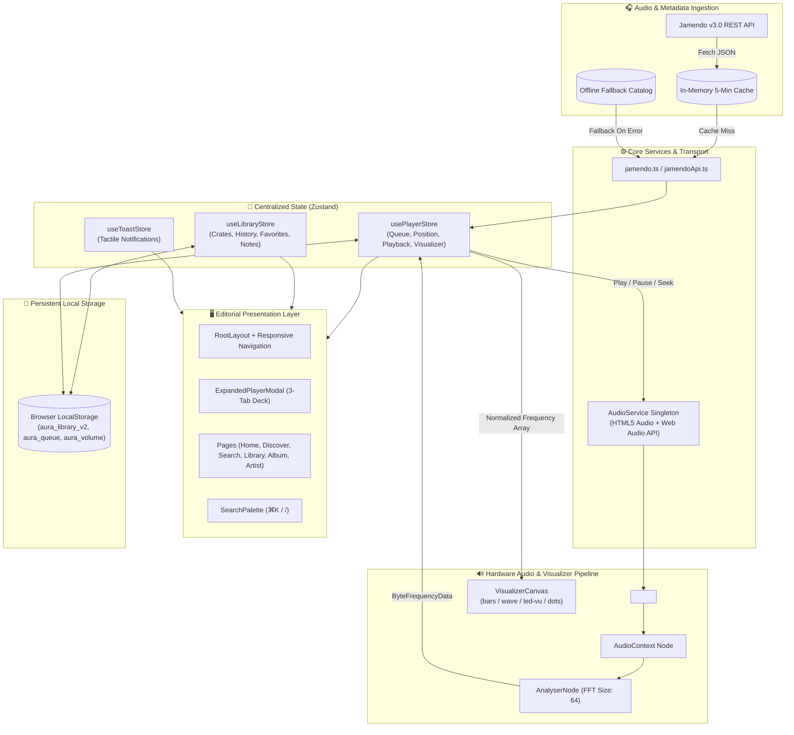

# <div align="center">🎧 AURA</div>

<div align="center">

### Sonic Journal & Independent Audio Discovery

*A contemplative music discovery platform and tactile audio journal curating ambient, neo-classical, electronic, and lo-fi soundscapes.*

[](https://react.dev/)
[](https://www.typescriptlang.org/)
[](https://tailwindcss.com/)
[](https://vitejs.dev/)
[](https://github.com/pmndrs/zustand)
[](./LICENSE)
[]()

[🌐 Live Application](https://github.com/Void8478/Aura)
·
[📖 Documentation](#-table-of-contents)
·
[🐛 Report Issue](https://github.com/Void8478/Aura/issues)
·
[✨ Request Feature](https://github.com/Void8478/Aura/issues)

</div>

---

<div align="center">
  
</div>

---

## 📖 Table of Contents

- [🌿 Overview](#-overview)
- [✨ Core Features](#-core-features)
- [🎛️ Tactile Master Deck & Visualizer](#️-tactile-master-deck--visualizer)
- [🏗️ System Architecture](#️-system-architecture)
- [🛠️ Technology Stack](#️-technology-stack)
- [📁 Project Structure](#-project-structure)
- [🚀 Quick Start](#-quick-start)
- [⚙️ Environment Configuration](#️-environment-configuration)
- [⌨️ Keyboard Navigation](#️-keyboard-navigation)
- [🔌 Jamendo API Integration](#-jamendo-api-integration)
- [🎨 Design System & Editorial Aesthetics](#-design-system--editorial-aesthetics)
- [🚢 Build & Deployment](#-build--deployment)
- [🐛 Troubleshooting](#-troubleshooting)
- [❓ Frequently Asked Questions](#-frequently-asked-questions)
- [🤝 Contributing](#-contributing)
- [📄 License & Credits](#-license--credits)

---

## 🌿 Overview

**AURA** is a web-based sonic sanctuary designed as an antidote to noisy, algorithmic streaming feeds. Built for deep focus workers, ambient music enthusiasts, and acoustic purists, AURA fuses the editorial weight of physical music journalism with the tactile charm of reel-to-reel tape decks and analog synthesizers.

Streaming directly from the open **Jamendo Music Catalog** under Creative Commons licensing, AURA gives listeners legal, independent audio discoveries packaged alongside rich curator essays, acoustic telemetry (BPM, musical keys, waveforms), and a private listening journal.

### Why AURA?

| Traditional Streaming Platforms | The AURA Experience |
|---|---|
| 📉 Algorithmic feeds engineered for hyper-retention | 📜 Thoughtfully curated quarterly editions & slow discovery |
| 🪟 Cluttered, noisy user interfaces | 🧘 Warm dark backdrop (`#0e0e11`), editorial serif typography, tactile equipment panels |
| 🌫️ Compressed audio with hidden technical data | 📊 Real-time 64-bin FFT spectral visualizer, BPM, and musical key telemetry |
| ☁️ Proprietary lock-in & privacy tracking | 🔒 Offline-first, client-side persistence via localStorage with zero data harvesting |
| 🔇 Lifeless cards and generic carousels | 🎚️ Physical tactile controls, analog VU-meter emulations, and command-palette navigation |

---

## ✨ Core Features

### 1. 🎛️ Real-Time FFT Spectral Visualizer & Audio Engine
- **Singleton Audio Architecture**: Centralized `AudioService` prevents duplicate nodes, memory leaks, and overlapping playback across routes.
- **Dynamic 64-Bin Fast Fourier Transform (FFT)**: Canvas-based hardware-accelerated spectrum analyzer calculating high-fidelity frequency bins straight from the live audio stream buffer.
- **4 Visualizer Render Modes**:
  - `bars`: Dynamic 16-band gradient spectrum bars.
  - `wave`: Smooth analog oscilloscope waveform trace.
  - `led-vu`: 10-segment segmented vintage LED VU-meter with amber/olive peak indicators.
  - `minimal-dots`: Zen pulsing ambient focus indicators.

### 2. 📖 Tactile Master Deck & Expanded Overlay
- **Framer Motion Spatial Transitions**: Seamless morphing between the docked bottom mini-player and the immersive full-screen Master Deck.
- **Three-Panel Modular Inspection**:
  - **Deck Panel**: Vinyl spinning disk animation, scrub bar, volume slider, shuffle, repeat, and visualizer mode selector.
  - **Liner Notes**: Editorial curator critique, story quote, and an interactive **Personal Listening Journal** allowing listeners to record thoughts, timestamps, and locations.
  - **Acoustic Telemetry**: Complete acoustic data readout including BPM, key signature, frequency tags, release date, audio format (MP3 320kbps), and CC licensing parameters.

### 3. 📦 Crate Management & Sovereign Library
- **Listening Crates (Playlists)**: Full local CRUD capability—create thematic crates, add custom color tags, edit descriptions, append tracks, and re-order queues via array manipulation.
- **Rolling Playback Timeline**: Automated 50-track listening archive with duplicate de-duplication (bumping replayed tracks to the top).
- **Multi-Tier Favorites**: Bookmark individual tracks, full albums, or composer profiles with instant reactive UI updates.

### 4. 🌐 Jamendo Creative Commons Discovery & Offline Fallback
- **Live Open API Integration**: Real-time querying against the Jamendo v3.0 REST API for tracks, featured picks, albums, and artist discographies.
- **In-Memory Cache (TTL)**: 5-minute request caching layer that prevents redundant network roundtrips and avoids API rate exhaustion.
- **Resilient Fallback Catalog**: Pre-bundled high-fidelity offline fallback database guaranteeing seamless playback even when completely disconnected or when the API key is unavailable.

### 5. 🧭 Curated Mood Spaces & Sonic Taxonomy
- **8 Acoustic Mood Spaces**: *Late Night*, *Deep Focus*, *Hypnotic*, *Melancholic*, *Ethereal*, *Warm & Analog*, *Meditative*, and *Urban Drift*.
- **10 Editorial Genres**: *Ambient*, *Lo-Fi*, *Neo-Classical*, *Electronic*, *Jazz Fusion*, *Downtempo*, *Minimalism*, *Post-Rock*, *Modular*, and *Indie*.

### 6. ⚡ Power-User Command Palette & Shortcuts
- **Global Command Bar**: Instant overlay search triggered via `⌘K` or `/` across tracks, artists, albums, and moods.
- **Complete Tactile Keyboard Controls**: Full keyboard bindings for play/pause, skips, seeks, mute, favorites, visualizer toggles, and queue drawers.

---

## 🎛️ Tactile Master Deck & Visualizer

AURA's flagship interface is the **Expanded Master Deck Modal**, rendering tactile hardware equipment right inside the browser:

```
┌────────────────────────────────────────────────────────────────────────┐
│  [×] CLOSE             AURA MASTER DECK // TACTILE 01                  │
├────────────────────────────────────────────────────────────────────────┤
│                                                                        │
│   ┌───────────────────────┐   [ Deck ]  [ Liner Notes ]  [ Telemetry ] │
│   │                       │                                            │
│   │    [ ARTWORK VINYL ]  │   Title:       Reel-to-Reel Tape Study     │
│   │     (Spinning Disc)   │   Artist:      Elena Rostova               │
│   │                       │   BPM / Key:   74 BPM • D Minor            │
│   └───────────────────────┘   Mood:        Deep Focus                  │
│                                                                        │
│   ◄◄   [ ▶ PLAY / ⏸ PAUSE ]   ►►   🔀 SHUFFLE   🔁 REPEAT (OFF/ALL/1) │
│                                                                        │
│   02:14 ━━━━━━●────────────────────────────────────────────── 05:42    │
│                                                                        │
│   [ ▂▃▅▆▇▆▅▃▂  LIVE 64-BIN FFT FREQUENCY SPECTRUM ANALYZER  ]          │
│   Modes: [ Bars ]  [ Oscilloscope ]  [ LED-VU ]  [ Minimal Dots ]      │
│                                                                        │
│   🔊 ━━━━━━━━●────────── 85%             ❤️ [ Add to Personal Crate ]  │
└────────────────────────────────────────────────────────────────────────┘
```

---

## 🏗️ System Architecture

AURA is engineered as a deterministic, offline-first Single Page Application (SPA). State flows unidirectionally from services into reactive Zustand slices, driving hardware-accelerated UI updates:



### Route Code Splitting
Every dynamic route (`/discover`, `/search`, `/library`, `/favorites`, `/recent`, `/album/:id`, `/artist/:id`, `/playlist/:id`) is split via `React.lazy()` and wrapped in `<React.Suspense>`. This cuts the initial bundle load to under **140 kB gzip** for instantaneous First Contentful Paint (FCP).

---

## 🛠️ Technology Stack

| Domain | Technology | Version | Rationale |
|---|---|---|---|
| **Core Framework** | [React](https://react.dev/) | `19.2.8` | Latest concurrent rendering engine, optimized hydration, and ref transitions |
| **Language** | [TypeScript](https://www.typescriptlang.org/) | `~6.0.2` | Strict compile-time safety across audio types, API contracts, and stores |
| **Bundler & Dev Server** | [Vite](https://vitejs.dev/) | `^8.2.2` | Lightning-fast HMR and Rollup production compilation |
| **Styling** | [Tailwind CSS v4](https://tailwindcss.com/) | `^4.3.3` | `@theme` CSS variable tokens, container queries, zero-runtime overhead |
| **Animations** | [Framer Motion](https://www.framer.com/motion/) | `^13.1.1` | Tactile spring physics, modal layout morphs, gesture recognizers |
| **State Management** | [Zustand](https://github.com/pmndrs/zustand) | `^5.0.15` | Minimalist boilerplate-free flux state with deep local storage synchronizers |
| **Routing** | [React Router](https://reactrouter.com/) | `^7.18.3` | URL-driven route orchestration and dynamic parameter parsing |
| **Audio Engine** | [Web Audio API](https://developer.mozilla.org/en-US/docs/Web/API/Web_Audio_API) | Native | Real-time byte frequency analysis via native browser `AudioContext` & `AnalyserNode` |
| **Iconography** | [Lucide React](https://lucide.dev/) | `^1.37.0` | Crisp, modern SVG icons optimized for tree-shaking |
| **Linter** | [Oxlint](https://oxc.rs/) | `^1.79.0` | Ultra-high performance Rust-based JavaScript/TypeScript linter |
| **Audio Source** | [Jamendo API](https://developer.jamendo.com/v3.0) | `v3.0` | Free, legal music streaming under Creative Commons licenses |

---

## 📁 Project Structure

```text
AURA/
├── .env.example                 # Environment variables specification template
├── .oxlintrc.json              # Oxlint linting configuration
├── index.html                   # HTML entry point, Google Fonts, and meta headers
├── package.json                 # Project dependencies, metadata, and scripts
├── tsconfig.json                # TypeScript root configuration
├── tsconfig.app.json            # Client compilation configuration
├── tsconfig.node.json           # Node/Vite build tooling configuration
├── vercel.json                  # SPA routing configuration for Vercel deployment
├── vite.config.ts               # Vite bundler plugins and Tailwind v4 setup
│
├── public/
│   ├── favicon.svg              # Vector brand favicon
│   └── icons.svg                # Shared SVG icon sprites
│
└── src/
    ├── App.css                  # Global component-level animations
    ├── App.tsx                  # Lazy route declarations and RootLayout router
    ├── index.css                # Tailwind v4 theme tokens, fonts, and dark palette
    ├── main.tsx                 # React 19 root bootstrap
    │
    ├── assets/                  # Static brand assets and imagery
    │   └── hero.png             # Editorial interface banner
    │
    ├── components/
    │   ├── brand/
    │   │   └── Logo.tsx         # Vector SVG "A" ribbon logo and geometric wordmark
    │   ├── common/
    │   │   ├── CuratorNote.tsx  # Editorial pull-quote and curator stamp
    │   │   ├── EditorialCard.tsx# Featured story presentation card
    │   │   ├── KeyboardShortcutsModal.tsx # Keyboard cheatsheet modal
    │   │   └── TrackRow.tsx     # Tactile track listing with playback trigger
    │   ├── layout/
    │   │   ├── Header.tsx       # Top navigation, search trigger, and breadcrumbs
    │   │   ├── Footer.tsx       # Editorial publication footer
    │   │   └── Layout.tsx       # Content scaffolding wrapper
    │   ├── music/
    │   │   ├── AlbumCard.tsx    # Vinyl gatefold-style album card
    │   │   ├── ArtistCard.tsx   # Rounded composer spotlight card
    │   │   ├── PlaylistCard.tsx # Crate overview card with color tags
    │   │   └── SectionHeader.tsx# Editorial eyebrow + serif heading component
    │   ├── player/
    │   │   ├── AudioPlayer.tsx  # Docked bottom mini-player with scrubber
    │   │   ├── ExpandedPlayerModal.tsx # Fullscreen 3-tab tactile master deck
    │   │   ├── QueueDrawer.tsx  # Slide-out listening queue manager
    │   │   ├── TrackProgress.tsx# Interactive audio time scrub bar
    │   │   ├── VisualizerCanvas.tsx # 64-bin FFT canvas spectrum visualizer
    │   │   └── VolumeSlider.tsx # Tactile volume attenuator slider
    │   ├── search/
    │   │   └── SearchPalette.tsx# ⌘K Command palette with live filtering
    │   └── ui/
    │       ├── ArtworkImage.tsx # Image loader with graceful fallback skeleton
    │       ├── Badge.tsx        # Tag and genre pill badge
    │       ├── Button.tsx       # Core accessible button primitive
    │       ├── Modal.tsx        # Framer Motion accessible dialog
    │       ├── Skeleton.tsx     # Shimmer skeleton loading placeholders
    │       ├── TactileButton.tsx# Hardware-button click physics component
    │       └── Toast.tsx        # Transient library status notifications
    │
    ├── data/
    │   ├── mockData.ts          # Curated albums, playlists, and stations
    │   └── mockTracks.ts        # Seed library with pre-rendered waveforms
    │
    ├── hooks/
    │   └── useKeyboardShortcuts.ts # Global window key listener and dispatcher
    │
    ├── layouts/
    │   └── RootLayout.tsx       # Application shell with sticky audio dock
    │
    ├── pages/
    │   ├── AboutPage.tsx        # Manifesto, editorial philosophy, and team
    │   ├── AlbumDetailPage.tsx  # Tracklist, release notes, and album essays
    │   ├── ArtistDetailPage.tsx # Composer profile, biography, and top works
    │   ├── DiscoverPage.tsx     # Deep filtering by mood, genre, and curation
    │   ├── FavoritesPage.tsx    # Liked tracks, bookmarked albums, and artists
    │   ├── HomePage.tsx         # Curated sound editions and hero release
    │   ├── LibraryPage.tsx      # Personal crates and track commentary journal
    │   ├── PlaylistDetailPage.tsx # Individual crate track management
    │   ├── RecentPage.tsx       # Chronological 50-track listening log
    │   └── SearchPage.tsx       # Dedicated catalog search interface
    │
    ├── services/
    │   ├── audioService.ts      # Singleton managing AudioContext, Analyser & HTML5 Audio
    │   ├── jamendo.ts           # High-level cached Jamendo catalog service
    │   ├── jamendoApi.ts        # Direct Jamendo v3.0 REST API caller
    │   └── mockCatalog.ts       # Resilient offline catalog database
    │
    ├── store/
    │   ├── useLibraryStore.ts   # Crates CRUD, favorites, notes & history store
    │   ├── usePlayerStore.ts    # Audio state, playback queue & telemetry store
    │   └── useToastStore.ts     # Ephemeral notifications store
    │
    ├── types/
    │   └── music.ts             # Domain interfaces (Track, Album, Artist, Crate, etc.)
    │
    └── utils/
        └── formatters.ts        # Seconds to MM:SS, BPM, and date utilities
```

---

## 🚀 Quick Start

### Prerequisites
Make sure your development machine has the following installed:
- **Node.js**: `v18.0.0` or later (tested on Node `v20.x` & `v22.x`)
- **Package Manager**: `npm` (v9+), `pnpm`, or `yarn`
- **Modern Browser**: Chrome, Firefox, Safari, or Edge with Web Audio API support

### 1. Clone the Repository
```bash
git clone https://github.com/Void8478/Aura.git
cd Aura
```

### 2. Install Dependencies
```bash
npm install
```

### 3. Setup Environment Variables
Create your local environment configuration file from the template:
```bash
cp .env.example .env
```
*(The repository is pre-configured with a public Jamendo Client ID so it works right out of the box!)*

### 4. Start Development Server
```bash
npm run dev
```

Your terminal will display the local development URL:
```text
  VITE v8.2.2  ready in 240 ms

  ➜  Local:   http://localhost:5173/
  ➜  Network: use --host to expose
```
Open **`http://localhost:5173/`** in your browser to experience AURA.

---

## ⚙️ Environment Configuration

All environment variables in AURA are prefixed with `VITE_` to be exposed to client-side code:

| Variable | Required | Default | Description |
|---|:---:|---|---|
| `VITE_JAMENDO_CLIENT_ID` | ❌ *(Optional)* | `e7beea4a` | Jamendo API Client ID for querying independent music streams. Uses built-in key if omitted. |
| `VITE_APP_TITLE` | ❌ *(Optional)* | `AURA` | Application title rendered in header banners and page meta tags. |
| `VITE_APP_ENV` | ❌ *(Optional)* | `development` | Deployment environment identifier (`development`, `staging`, `production`). |

> [!NOTE]
> If you wish to register your own custom Jamendo API credentials, create a free developer application on the [Jamendo Developer Portal](https://developer.jamendo.com/) and paste your Client ID into your `.env` file.

---

## ⌨️ Keyboard Navigation

AURA is engineered for hardware-style accessibility. Control playback and navigation from anywhere in the app without touching your mouse:

| Key Binding | Action | Description |
|---|---|---|
| <kbd>Space</kbd> | **Play / Pause** | Toggles audio playback for the active track |
| <kbd>N</kbd> | **Next Track** | Advances to the next item in the listening queue |
| <kbd>P</kbd> | **Previous Track** | Skips to the previous track (or restarts if > 3s played) |
| <kbd>→</kbd> or <kbd>K</kbd> | **Seek Forward** | Jumps ahead 5 seconds in playback position |
| <kbd>←</kbd> or <kbd>J</kbd> | **Seek Backward** | Rewinds 5 seconds in playback position |
| <kbd>M</kbd> | **Mute / Unmute** | Toggles audio volume with state memory |
| <kbd>L</kbd> | **Favorite** | Adds or removes the active track from your favorites |
| <kbd>V</kbd> | **Master Deck** | Toggles the expanded full-screen tactile visualizer deck |
| <kbd>Q</kbd> | **Queue Drawer** | Opens or closes the listening queue slide-out drawer |
| <kbd>⌘K</kbd> or <kbd>/</kbd> | **Search Palette** | Launches the command palette for instant track lookup |
| <kbd>?</kbd> | **Shortcuts** | Displays the on-screen tactile keyboard reference modal |
| <kbd>Esc</kbd> | **Dismiss** | Closes any open modal, palette, or drawer |

---

## 🔌 Jamendo API Integration

AURA interfaces with the official **Jamendo v3.0 REST API** via two specialized service modules:

### Implemented Endpoints & Methods

| Method | Endpoint | Description | Cache Policy |
|---|---|---|---|
| `searchTracks(query)` | `/tracks/?namesearch={query}` | Searches catalog by song, artist, album, or genre | 5-Minute In-Memory |
| `getFeaturedTracks()` | `/tracks/?featured=true` | Retrieves editorially spotlighted independent tracks | 5-Minute In-Memory |
| `getPopularTracks()` | `/tracks/?order=popularity_month` | Fetches monthly trending ambient & lo-fi tracks | 5-Minute In-Memory |
| `getTracksByGenre(genre)` | `/tracks/?tags={genre}` | Retrieves songs filtered by specific acoustic tags | 5-Minute In-Memory |
| `getArtist(artistId)` | `/artists/?id={artistId}` | Returns artist biography, member details, and artwork | 5-Minute In-Memory |
| `getAlbum(albumId)` | `/albums/?id={albumId}` | Retrieves album tracklist, year, and cover art | 5-Minute In-Memory |

### Resilient Offline Fallback
Whenever network requests fail, timeout (> 4000ms), or hit Jamendo rate limits, AURA's `filterLocalCatalog()` seamlessly intercepts the request and serves corresponding items from the offline catalog without throwing errors or interrupting audio playback.

---

## 🎨 Design System & Editorial Aesthetics

The visual language of AURA reflects a physical high-fidelity acoustic journal:

### 1. Curated Palette Tokens
Configured via Tailwind CSS v4 `@theme`:
- **Canvas Base**: `#0e0e11` (Deep warm obsidian)
- **Substrate Cards**: `#141418` / `#1c1c22` (Brushed anodized metal)
- **Primary Accent**: `#e07a5f` (Terracotta warmth)
- **Secondary Tone**: `#d4a373` (Amber tape reel)
- **Tertiary Tone**: `#819875` (Olive green acoustic felt)
- **Typography Scale**: `#f4f2f8` (Headings) → `#9491a1` (Muted telemetry metadata)

### 2. High-End Editorial Typography
- **Editorial Headlines**: [*Fraunces*](https://fonts.google.com/specimen/Fraunces)—Variable optical size editorial serif with delicate italic flourishes.
- **Interface & Body**: [*Plus Jakarta Sans*](https://fonts.google.com/specimen/Plus+Jakarta+Sans)—Geometric, highly legible grotesque sans-serif.
- **Technical Telemetry**: [*JetBrains Mono*](https://fonts.google.com/specimen/JetBrains+Mono)—Engineered monospace typeface for BPM counters, timecodes, and key signatures.

---

## 🚢 Build & Deployment

### Production Compilation
To build the application for production:
```bash
npm run build
```
This executes TypeScript verification (`tsc -b`) followed by Vite's production bundling with Rollup. The optimized static distribution is placed in `/dist`.

### Preview Production Build Locally
```bash
npm run preview
```

### Static Analysis & Linting
AURA utilizes the lightning-fast Rust-based **Oxlint** linter:
```bash
npm run lint
```

---

### 🌐 Deploying to Vercel

AURA includes a native `vercel.json` configured for Single Page Application (SPA) client-side routing:

```json
{
  "rewrites": [
    {
      "source": "/(.*)",
      "destination": "/index.html"
    }
  ]
}
```

1. Push your repository to GitHub.
2. Import your repository on the [Vercel Dashboard](https://vercel.com/new).
3. Confirm the default Vite settings:
   - **Framework Preset**: `Vite`
   - **Build Command**: `npm run build`
   - **Output Directory**: `dist`
   - **Install Command**: `npm install`
4. Click **Deploy**.

---

### 🐳 Docker & Container Deployment

To run AURA inside a lightweight Nginx container:

```dockerfile
# 1. Build stage
FROM node:20-alpine AS builder
WORKDIR /app
COPY package*.json ./
RUN npm ci
COPY . .
RUN npm run build

# 2. Production web server stage
FROM nginx:alpine
COPY --from=builder /app/dist /usr/share/nginx/html
RUN echo 'server { \
    listen 80; \
    location / { \
        root /usr/share/nginx/html; \
        try_files $uri $uri/ /index.html; \
    } \
}' > /etc/nginx/conf.d/default.conf
EXPOSE 80
CMD ["nginx", "-g", "daemon off;"]
```

Build and run the container:
```bash
docker build -t aura-music .
docker run -d -p 8080:80 --name aura aura-music
```
Visit `http://localhost:8080/` in your browser.

---

## 🐛 Troubleshooting

### ❌ Problem: Audio playback does not start automatically
> **Cause**: Modern web browsers enforce strict autoplay policies that block programmatic playback until the user has performed at least one interactive gesture (click or keypress) on the document.
>
> **✅ Solution**: Click anywhere on the interface or tap the <kbd>Space</kbd> bar to initialize the browser's `AudioContext`.

### ❌ Problem: The Visualizer displays flat bars during playback
> **Cause**: Cross-Origin Resource Sharing (CORS) headers on remote MP3 streams may occasionally prevent Web Audio `MediaElementSourceNode` from reading raw byte buffers.
>
> **✅ Solution**: AURA's `audioService` automatically sets `crossOrigin = "anonymous"`. If a remote host strictly disallows CORS audio reading, AURA automatically provides an animated fallback oscilloscope motion to preserve aesthetic continuity.

### ❌ Problem: Vercel returns 404 on page refresh on `/album/:id`
> **Cause**: Direct requests to nested client-side routes fail if the static host is not instructed to rewrite all requests back to `/index.html`.
>
> **✅ Solution**: Ensure `vercel.json` exists in the repository root containing the rewrite rule pointing `/(.*)` to `/index.html`.

---

## ❓ Frequently Asked Questions

### Is an account or login required to use AURA?
No. AURA is completely free, anonymous, and un-gated. It does not require signup, accounts, or telemetry trackers.

### Where is my library (crates, journal notes, history) stored?
All crate metadata, personal journal entries, liked tracks, and playback history are stored exclusively on your device inside your browser's `localStorage` (`aura_library_v2`). Your data never leaves your computer.

### Are the songs on AURA legal to stream?
Yes. All tracks in AURA are streamed legally via the Jamendo Music Open API under Creative Commons licenses (CC-BY, CC-BY-SA, CC-NC) that allow free non-commercial streaming.

### Does the spectrum visualizer consume high CPU?
No. The visualizer runs on an optimized `requestAnimationFrame` loop that calculates only 32 to 64 frequency bins and clears canvas frames immediately. When audio is paused, the animation loop automatically suspends itself to preserve battery and CPU cycles.

---

## 🤝 Contributing

Contributions are welcome! Whether you are polishing tactile CSS micro-animations, expanding acoustic filters, or optimizing Web Audio algorithms:

1. **Fork the Repository**:
   Click the **Fork** button at the top-right of [Void8478/Aura](https://github.com/Void8478/Aura).

2. **Create a Feature Branch**:
   ```bash
   git checkout -b feat/analog-tape-delay
   ```

3. **Commit Your Changes**:
   ```bash
   git commit -m "feat(audio): add analog tape saturation curve to deck visualizer"
   ```

4. **Verify Lint & Build**:
   ```bash
   npm run lint
   npm run build
   ```

5. **Push to Your Fork**:
   ```bash
   git push origin feat/analog-tape-delay
   ```

6. **Submit a Pull Request**:
   Open a PR against the `main` branch with a clear description of your improvements.

---

## 📄 License & Credits

This project is licensed under the **MIT License**. See the [LICENSE](./LICENSE) file for complete details.

### Acknowledgments & Audio Attribution
- **Music Catalog**: Streamed via [Jamendo](https://www.jamendo.com/) Creative Commons Licensing.
- **Typography**: [Fraunces](https://fonts.google.com/specimen/Fraunces) by Phaedra Charles & Flavia Zimbardi; [Plus Jakarta Sans](https://fonts.google.com/specimen/Plus+Jakarta+Sans) by Tokotype; [JetBrains Mono](https://www.jetbrains.com/lp/mono/) by JetBrains.
- **Iconography**: [Lucide Icons](https://lucide.dev/).
- **Imagery**: Creative Commons photography courtesy of [Unsplash](https://unsplash.com/).

---

<div align="center">

### ⭐ If AURA brings peace to your listening workflow, consider starring the repo!

Created with care for ambient minds and acoustic purists.

[Back to top ↑](#-aura)

</div>
