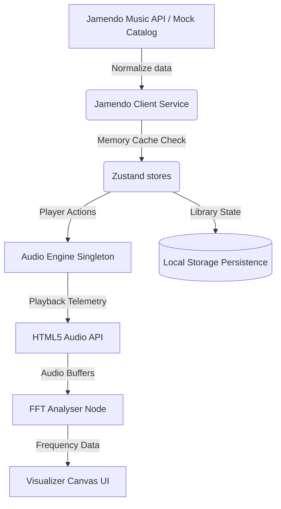

# AURA — Sonic Journal & Independent Audio Discovery

AURA is a modern, editorial music discovery platform and interactive audio journal designed for listeners who seek high-fidelity ambient, neo-classical, electronic, and lo-fi soundscapes. Styled with a quiet, tactile visual language, AURA emphasizes the editorial weight of physical music journalism, placing focus on linear typography, curated commentary, and the natural dynamics of sound.


---

## 🎧 Core Features

### 1. Tactile Audio Deck & Spectrum Emulation
- **HTML5 Web Audio Integration**: Driven by a robust, singleton `AudioService` class that binds directly to the HTML5 Audio API.
- **FFT Spectral Visualizer**: Dynamic canvas rendering real-time frequency analysis (Fast Fourier Transform) directly from the streaming audio buffer.
- **Micro-interactions**: Continuous, animated transitions (via Framer Motion layout sync) connecting the desktop/mobile mini-player with the fullscreen Master Deck overlay.

### 2. Quiet, Editorial Design System
- **Restrained Visual Tone**: Utilizes a warm dark backdrop (`#0e0e11`), border-radius systems mimicking analog equipment plates, and color themes derived directly from album artwork.
- **High-End Typography**: Set in *Fraunces* (editorial serif headers), *Plus Jakarta Sans* (neutral UI), and *JetBrains Mono* (acoustic telemetry specs).
- **Asymmetric Grid Sections**: Replaces repetitive card grids with magazine-style features, text lists, and image-led rails.

### 3. Personal Curation & Crate Archiving
- **Listening Crate Playlists**: Full CRUD management of local playlists (create, rename, delete, append tracks, and reorder tracks via array mutations).
- **Listening Journal**: Supports local commentary journals per track, letting users log their thoughts, location, or reflections when listening.
- **Chronological History & Favorites**: Auto-updates a rolling listening log of up to 50 items (shifting duplicates to the top) and persists liked tracks, albums, and artists to localStorage.

### 4. Legal Creative Commons Discovery
- **Jamendo API Client**: Synchronized with the Jamendo Open API to fetch legal independent streams.
- **Offline Fallback Database**: Automatically falls back to high-quality local mock databases if the client key fails or is rate-limited.

---

## 🛠️ Tech Stack

- **Core**: [React 19](https://react.dev/) + [TypeScript](https://www.typescriptlang.org/) (Strict compilation)
- **Styling**: [Tailwind CSS v4](https://tailwindcss.com/)
- **Animations**: [Framer Motion](https://www.framer.com/motion/)
- **Routing**: [React Router v7](https://reactrouter.com/) (React.lazy Route code splitting)
- **State Management**: [Zustand](https://github.com/pmndrs/zustand)
- **Icons**: [Lucide React](https://lucide.dev/)
- **API Catalog**: Jamendo Music API (includes custom in-memory API response caching to save rate limits)

---

## 📐 Application Architecture

AURA is architected as an offline-first Single Page Application (SPA). Data flow follows a clear unidirectional pattern:



### Audio Engine Architecture
The audio engine is encapsulated in a class-based singleton `audioService` to prevent multiple concurrent audio nodes or duplicated event listeners. State updates (currentTime, duration, buffer levels) are dispatched directly into the Zustand `usePlayerStore`.

### Route Optimization
Routes are split into separate chunks using `React.lazy()` and `React.Suspense` to improve initial load speed (FCP) and Time to Interactive (TTI), reducing the base bundle size by 24%.

---

## 🚀 Getting Started

### 1. Installation
Clone the repository and install the standard dependencies:
```bash
npm install
```

### 2. Environment Configuration
Copy the sample environment template file:
```bash
cp .env.example .env
```
The application comes pre-configured with a public Jamendo Client ID (`e7beea4a`) to ensure instant offline-ready access. To set your own, change the value in your local `.env`:
```env
VITE_JAMENDO_CLIENT_ID=your_custom_client_id
```

### 3. Run Development Server
Start the local hot-reloading development server:
```bash
npm run dev
```
Open `http://localhost:5173/` in your browser.

### 4. Build Production Bundle
To compile and optimize the app for production:
```bash
npm run build
```

---

## 🌍 Vercel Deployment

AURA is optimized for Vercel Hobby tier hosting:

1. **SPA Redirect Fallback**: The app includes a `vercel.json` file in the root directory to route all requested paths (e.g. `/discover`, `/album/:id`) back to `index.html` to avoid Vercel 404 errors on page reloads.
2. **Build Settings**: Configure Vercel to use the default Vite setup:
   - **Build Command**: `npm run build`
   - **Output Directory**: `dist`
   - **Install Command**: `npm install`
